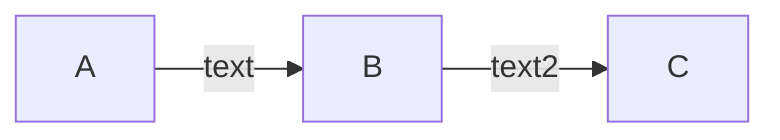
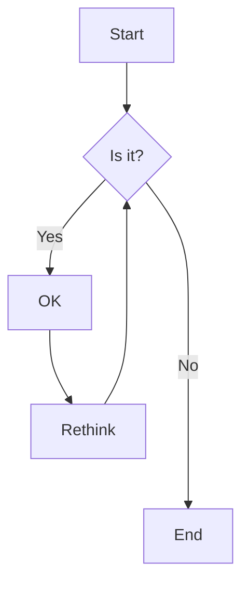
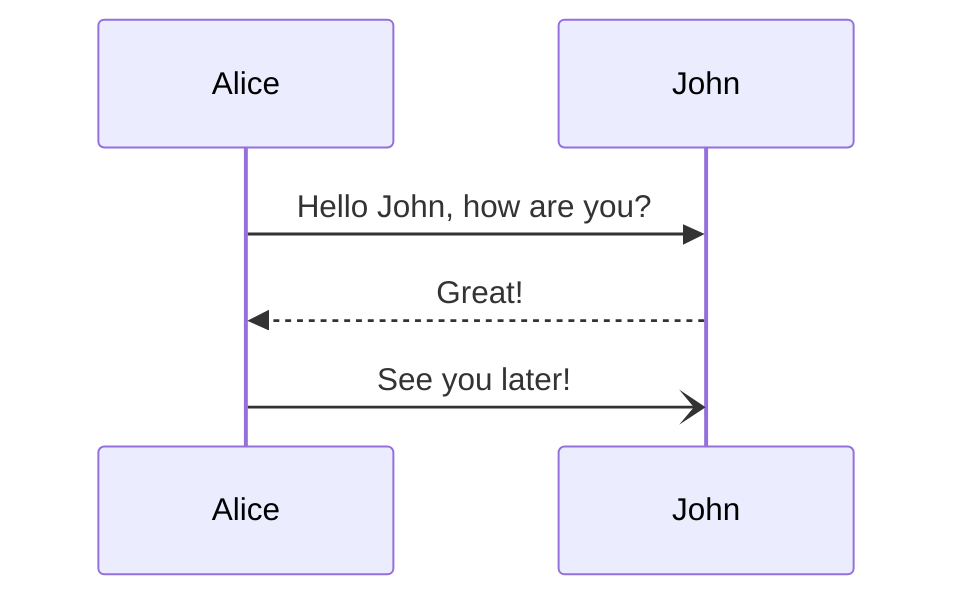
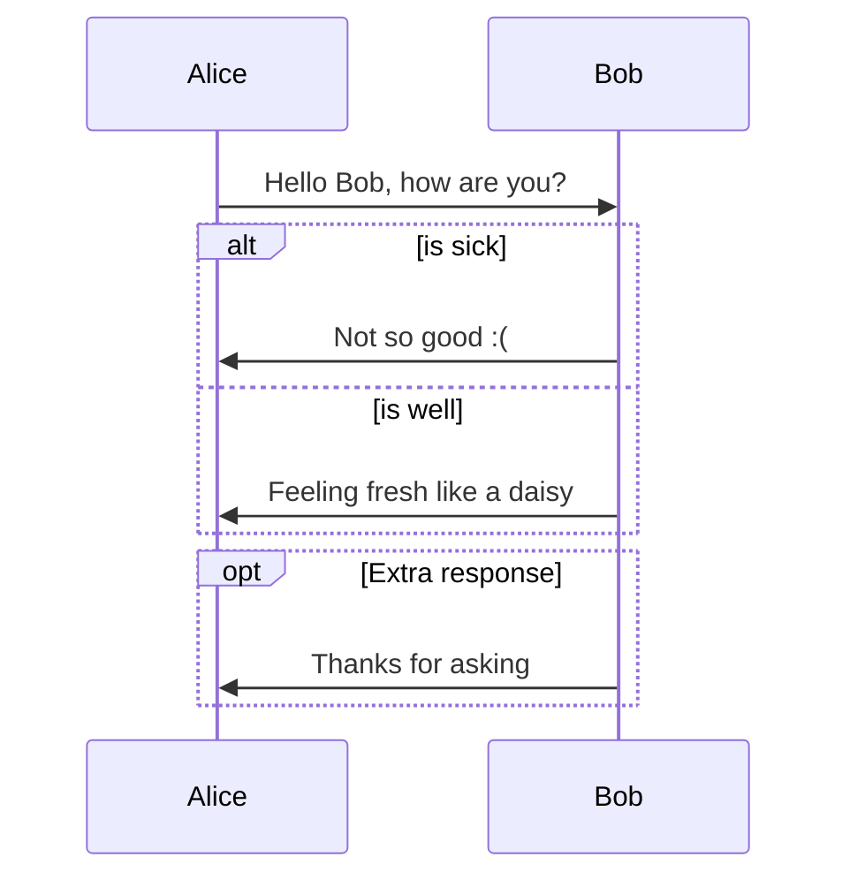
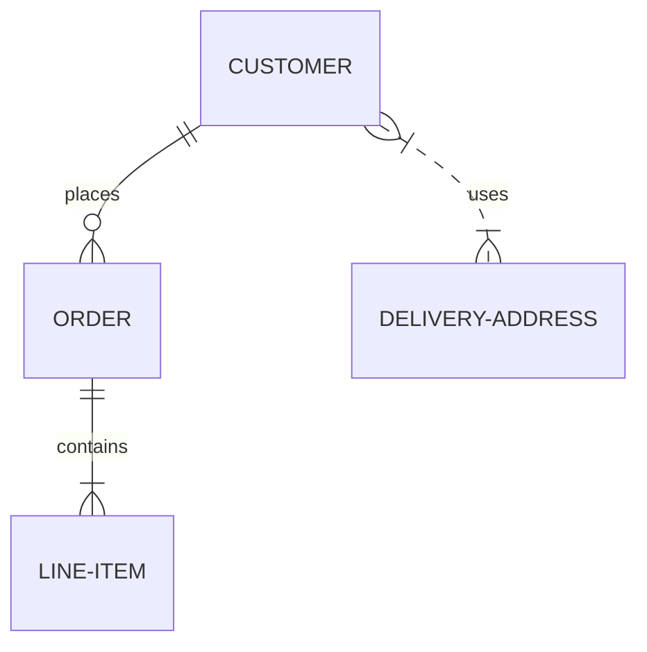

# metalsmith-mermaid

[](https://www.npmjs.com/package/metalsmith-mermaid)
[](https://www.npmjs.com/package/metalsmith-mermaid)

[](https://snyk.io/test/npm/metalsmith-mermaid)
[](https://codecov.io/gh/emmercm/metalsmith-mermaid)
[](https://codeclimate.com/github/emmercm/metalsmith-mermaid/maintainability)

[](https://github.com/emmercm/metalsmith-mermaid)
[](https://github.com/emmercm/metalsmith-mermaid/blob/master/LICENSE)

A Metalsmith plugin to render Mermaid diagrams in files.

This plugin works by finding all [Mermaid](https://mermaid-js.github.io/mermaid/#/) code blocks in Markdown files, rendering them to SVG, and replacing them with the SVG in-place.

You should run this plugin before any Markdown rendering plugins such as [`@metalsmith/markdown`](https://www.npmjs.com/package/@metalsmith/markdown).

## Installation

```bash
npm install --save metalsmith-mermaid
```

## JavaScript Usage

This plugin requires ES6 syntax:

```javascript
import path from 'path';

import Metalsmith from 'metalsmith';
import mermaid    from 'metalsmith-mermaid';

Metalsmith(path.resolve())
    .use(mermaid({
        // options here
    }))
    .build((err) => {
        if (err) {
            throw err;
        }
    });
```

## Options

### `markdown` (optional)

Type: `string` Default: `**/*.md`

A [`micromatch`](https://www.npmjs.com/package/micromatch) glob pattern to find Markdown files.

### `mermaid` (optional)

Type: `object` Default:

```json
{
    "theme": "neutral",
    "er": {
      "diagramPadding": 10
    },
    "flowchart": {
      "diagramPadding": 10
    },
    "sequence": {
      "diagramMarginX": 10,
      "diagramMarginY": 10
    },
    "gantt": {}
}
```

An object of [Mermaid options](https://github.com/mermaid-js/mermaid/blob/develop/docs/Setup.md#configuration).

## Examples

Here are a few examples from the [official documentation](https://mermaid-js.github.io/mermaid/#/) to get an idea of what types of diagrams are possible.

Flowcharts:

`````markdown

`````

`````markdown

`````

Sequence diagrams:

`````markdown

`````

`````markdown

`````

Entity relationship diagrams (ERDs):

`````markdown

`````

## Changelog

[Changelog](./CHANGELOG.md)
